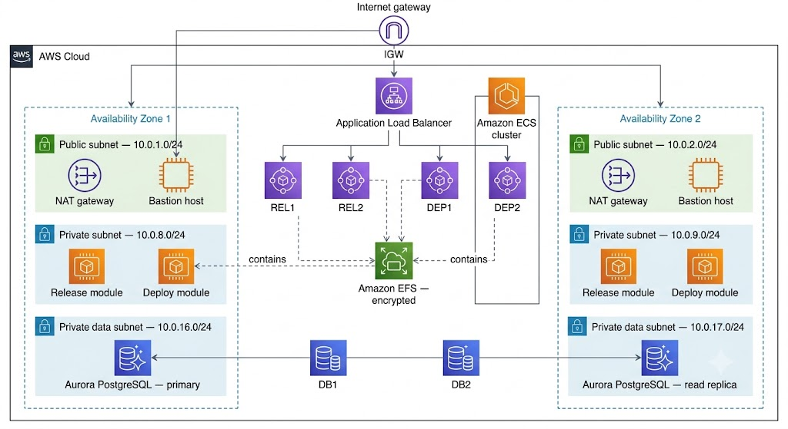
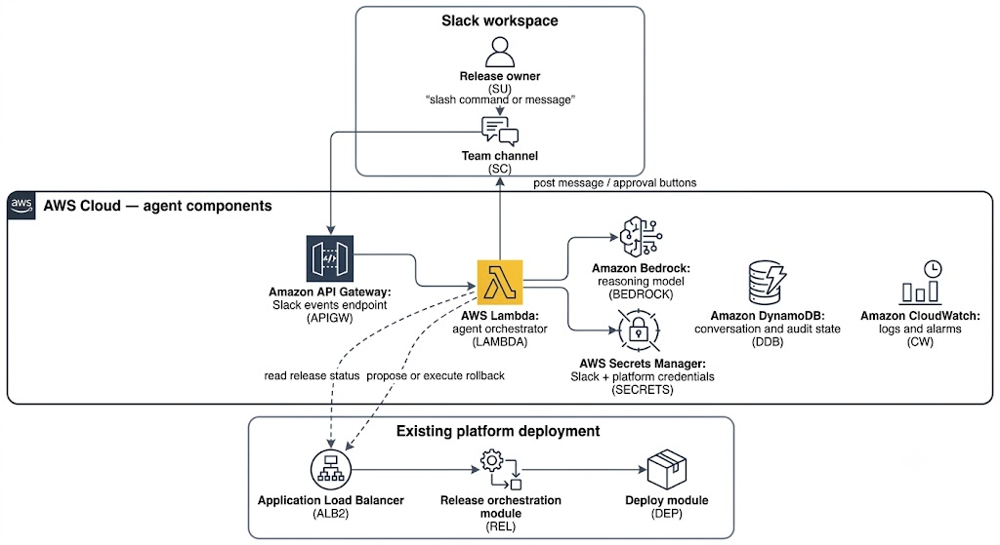
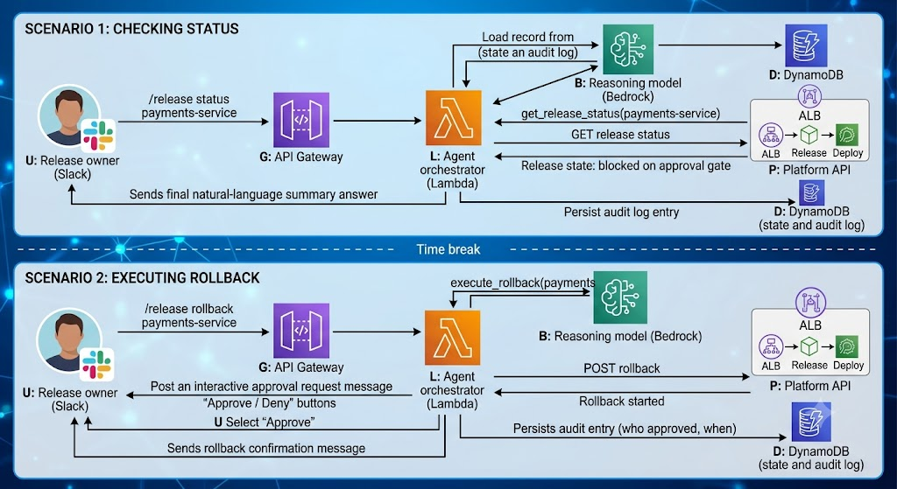

# AWS Deployment Guide

## Contents

1. [Overview](#overview)
2. [Architecture](#architecture)
3. [Prerequisites](#prerequisites)
4. [Deployment options](#deployment-options)
5. [Deployment steps](#deployment-steps)
6. [AI Agent deployment](#observation-through-an-ai-agent)
7. [Use case: Deploy an autonomous release agent integrated with Slack on AWS](#use-case-deploy-an-autonomous-release-agent-integrated-with-slack-on-aws)
8. [Best practices](#best-practices)
9. [Troubleshooting](#troubleshooting)
10. [Additional resources](#additional-resources)

## Overview

This quick start guide helps in deploying a release-orchestration and deployment-automation platform on Amazon Web Services (AWS), then extend it with an **AI Agent** that lets your team monitor and control releases from Slack.

The platform has two modules:

| Module | Purpose |
|---|---|
| Release orchestration module | Defines and automates the steps in your software delivery pipeline, tracks dependencies between releases, and reports on release status and compliance metrics. |
| Deployment automation module | Generates provisioning and deployment plans from your infrastructure and application configuration, and performs automated rollbacks when a deployment fails. |

Both modules run as containers on Amazon Elastic Container Service (Amazon ECS). The AI Agent observes these modules, reasons about pipeline state, and acts on your behalf — with guardrails — through a Slack interface.

### Costs and licensing

You're responsible for the cost of the AWS resources this deployment creates. The base CloudFormation template doesn't add an additional cost on top of the underlying AWS services; the AI Agent extension adds a small number of serverless resources that are billed separately.

Before you deploy:

- Use the [AWS Pricing Calculator](https://calculator.aws) to estimate the monthly cost of the EC2, RDS, EFS, and load balancer resources.
- Set up an [AWS Budget](https://docs.aws.amazon.com/cost-management/latest/userguide/budgets-managing-costs.html) with an alert threshold.
- Enable the [AWS Cost and Usage Report](https://docs.aws.amazon.com/cur/latest/userguide/what-is-cur.html) to track costs after deployment.

You need a trial or commercial license for the platform before you deploy. Obtain a license from your software vendor and have the license file (or its base64-encoded contents) ready before you begin the process.

## Architecture

Traffic enters through the internet gateway. The Application Load Balancer distributes requests across the release and deployment containers in both Availability Zones. Each container reads and writes shared configuration on the encrypted EFS volume, and the Aurora PostgreSQL cluster provides highly available storage for platform data, with a primary instance in one zone and a read replica in the other. Bastion hosts give you SSH access to the private subnets without exposing the ECS hosts directly to the internet.

The template sets up:

- A highly available architecture spanning two Availability Zones.
- A VPC with public, private, and private data subnets, following AWS best practices.
- An internet gateway for bastion host and load balancer traffic.
- NAT gateways in the public subnets for outbound internet access from private subnets.
- A Linux bastion host in an Auto Scaling group for inbound SSH access.
- An Amazon ECS cluster running on EC2 instances, hosting the release orchestration and deployment automation containers.
- The release orchestration module in full cluster mode.
- The deployment automation module in high-availability (hot-standby) mode.
- An Amazon Aurora PostgreSQL cluster in the private data subnets.
- An encrypted Amazon EFS volume for disk-based configuration and data.
- An Application Load Balancer that routes incoming requests to the platform containers.

>**Note**: The architecture description states that bastion hosts are always created, but the `InstallBastionHost` parameter defaults to `False`. If you need SSH access to the environment, set this parameter to `True`; otherwise no bastion host is created and the diagram's bastion path doesn't apply.

The template that deploys into an existing VPC skips VPC-level tasks (marked above) and instead prompts you for your existing subnet and networking configuration.

## Prerequisites

### Technical requirements

- An AWS account. [Create one](https://aws.amazon.com) if you don't already have one.
- Permission to launch AWS CloudFormation templates that create AWS Identity and Access Management (IAM) roles.
- A trial or commercial license for the platform.

>**Note**: Obtain the following permissions for your IAM identity:

- `cloudformation`
- `ec2`
- `ecs`
- `rds`
- `elasticfilesystem`
- `elasticloadbalancing`
- `iam`
- `autoscaling`
- `lambda`

>**Note**: Scope the above permissions down after deployment, per your organization's least-privilege policy.

### Additional prerequisites (audit additions)

- **Service quotas**: Check your account's quota for the EC2 instance types this template uses (`m5.xlarge` for the platform nodes, `db.r4.large` for the database). [Request a quota increase](https://console.aws.amazon.com/servicequotas/) if you're near the default limit.
- **A key pair**: Create an [Amazon EC2 key pair](https://docs.aws.amazon.com/AWSEC2/latest/UserGuide/ec2-key-pairs.html) in the AWS Region where you plan to deploy.
- **A TLS certificate (recommended)**: If you want HTTPS access to both modules, request or import a certificate in [AWS Certificate Manager (ACM)](https://docs.aws.amazon.com/acm/latest/userguide/gs.html) before you launch the stack, and supply its ARN as the `SslCertificateArn` parameter. If you leave this parameter at its default, only the deployment automation module is reachable over HTTPS.
- **A restricted remote-access CIDR**: Have the IP range that should be allowed to reach the bastion host and load balancer. Don't use `0.0.0.0/0` in production.
- **Existing-VPC deployments only**: four private subnets across two Availability Zones (two application subnets with NAT routes, two data subnets with no internet route), and the DNS `domain-name` DHCP option set as described in the [Amazon VPC documentation](https://docs.aws.amazon.com/vpc/latest/userguide/vpc-dhcp-options.html).

### Recommended background knowledge

- Amazon Aurora
- Amazon EC2
- Amazon EFS
- Amazon VPC
- AWS CloudFormation
- AWS IAM
- AWS Lambda
- Container concepts (Docker, Amazon ECS)
- Foundation of AI Agent model basics

## Deployment options

| Option | Description | Use when |
|---|---|---|
| New VPC | Builds a new VPC, subnets, NAT gateways, security groups, and bastion hosts, then deploys the platform into it. | You want an end-to-end, self-contained environment. |
| Existing VPC | Deploys the platform into subnets you already manage. | You need to integrate with existing networking, security, or shared-services accounts. |

Both options let you configure CIDR blocks, instance types, and platform settings. Each deployment takes about 40 minutes.

## Deployment steps

### Step 1: Prepare your AWS account

1. [Create an AWS account](https://aws.amazon.com) if you don't already have one.
2. In the AWS Management Console navigation bar, select the Region where you want to deploy.

   >**Note**: Amazon EFS isn't available in every AWS Region. Confirm your target Region appears on the [AWS Regions and Endpoints](https://docs.aws.amazon.com/general/latest/gr/rande.html) page before you continue.
3. Create a [key pair](https://docs.aws.amazon.com/AWSEC2/latest/UserGuide/ec2-key-pairs.html) in your target Region.
4. If necessary, [request a service quota increase](https://console.aws.amazon.com/servicequotas/) for the EC2 instance types you plan to use.
5. Set up an AWS Budget alert for the account or tag you use to track this deployment's cost. Refer the cost and licensing section.

### Step 2: Obtain a license

To obtain a trial or commercial license from your software vendor, you require:

- The license file, base64-encoded, if the template requires it as a parameter.
- Confirmation that you accept the vendor's end-user license agreement (EULA) — required regardless of license type.

### Step 3: Launch the stack

1. Open the AWS CloudFormation console and choose to create a new stack, using the template for your chosen [deployment option](#4-deployment-options).
2. Confirm the Region displayed in the console.
3. On the Select Template page, keep the default template URL and choose **Next**.
4. On the Specify Details page, enter a stack name and set the parameters described below. Select **Next** when you're done.

#### Parameters — new VPC deployment

**VPC network configuration**

| Parameter | Default | Description |
|---|---|---|
| Remote access CIDR | Required | CIDR range allowed to reach the environment. Use a constrained range, not `0.0.0.0/0`. |
| Availability Zones | Required | Two Availability Zones for the subnets. |
| VPC CIDR | 10.0.0.0/19 | CIDR block for the VPC. |
| Private subnet 1 / 2 | 10.0.8.0/24 / 10.0.9.0/24 | Application subnets, one per Availability Zone. |
| Private data subnet 1 / 2 | 10.0.16.0/24 / 10.0.17.0/24 | Database subnets, one per Availability Zone. |
| Public subnet 1 / 2 | 10.0.1.0/24 / 10.0.2.0/24 | DMZ subnets, one per Availability Zone. |

**Database configuration**

| Parameter | Default | Description |
|---|---|---|
| Database administrator username | xldevops | 1–16 alphanumeric characters, starting with a letter. |
| Database administrator password | Required | 8–41 alphanumeric characters. No spaces, `@`, `/`, or `"`. |
| DB backup retention period | 7 | Days to retain automatic snapshots. |
| DB instance class | db.r4.large | Compute and memory class for the database instance. |

**HTTP configuration**

| Parameter | Default | Description |
|---|---|---|
| SSL certificate ARN | `default` | ARN of the ACM certificate that secures access. The default value doesn't secure the release orchestration module. |
| Load balancer type | internet-facing | `internet-facing` or `internal`. |

**General settings**

| Parameter | Default | Description |
|---|---|---|
| Environment name | devops | Logical name for the environment. |
| Key name | Required | Existing EC2 key pair name. |
| Install bastion host | False | Whether to create a bastion host for SSH access. Set to `True` if you need direct SSH access. |

**Platform configuration**

| Parameter | Default | Description |
|---|---|---|
| Platform instance type | m5.xlarge | Instance type for the platform's ECS container hosts. |
| Install deployment automation module | True | Whether to install this module in the cluster. |
| Deployment automation module version | Required | Version to deploy. |
| Deployment automation module administrator password | Required | 8+ characters. |
| Deployment automation module cluster mode | default | Cluster mode setting. |
| Deployment automation module license | trial | Base64-encoded license. |
| Install release orchestration module | True | Whether to install this module in the cluster. |
| Release orchestration module version | Required | Version to deploy. |
| Release orchestration module administrator password | Required | 8+ characters. |
| Release orchestration module cluster mode | default | Cluster mode setting. |
| Release orchestration module license | trial | Base64-encoded license. |
| Accept license terms | Required | Must be set to `yes` to deploy, regardless of license type. |
| EFS mount point | /mnt/efs | Documented only for the existing-VPC template in the original guide, but it also applies here. Set it explicitly in both. |

**Quick Start configuration**

| Parameter | Default | Description |
|---|---|---|
| S3 bucket name | (vendor default) | Bucket containing the deployment assets, if you're using a customized copy. |
| S3 bucket Region | us-east-1 | Region where that bucket is hosted. |
| S3 key prefix | (vendor default) | Key prefix simulating a folder for the deployment assets. |

#### Parameters — existing VPC deployment

Addition to the following, use the same Database, HTTP, Platform, and Quick Start parameters as above:

**Network configuration**

| Parameter | Default | Description |
|---|---|---|
| VPC ID | Required | ID of your existing VPC. |
| VPC CIDR | 10.0.0.0/19 | CIDR range of your VPC. |
| Remote access CIDR | Required | CIDR range allowed to reach the environment. |
| Public subnet 1 / 2 | Required | Existing public subnets, one per Availability Zone. |
| Private subnet 1 / 2 | Required | Existing application subnets, one per Availability Zone. |
| Private data subnet 1 / 2 | Required | Existing database subnets, one per Availability Zone. |

**General settings (existing VPC only)**

| Parameter | Default | Description |
|---|---|---|
| Bastion security group | Required | Security group that allows SSH access to the ECS hosts. |
| Use external database | True | Whether to use an externally managed database instead of provisioning Aurora. |

5. On the Options page, add tags and set advanced options, then choose **Next**.
6. On the Review page, confirm your settings. Under Capabilities, select the acknowledgment that the template creates IAM resources, and select **CAPABILITY_AUTO_EXPAND**.
7. Select **Create** to deploy the stack.
8. Monitor the stack until its status is `CREATE_COMPLETE`.
9. Select the **Outputs** tab to get the URLs for the deployed modules.

### Step 4: Test the deployment

After the stack reaches `CREATE_COMPLETE`, retrieve the hostname from the stack's Outputs tab — it's the DNS name of the Application Load Balancer. Use it to reach:

- `https://<load-balancer-dns-name>:4516` — deployment automation module
- `http://<load-balancer-dns-name>:5516` — release orchestration module

> **Note**: Both modules should ideally be reached over HTTPS, but the default configuration secures only port 4516. If you need HTTPS on both, supply a valid `SslCertificateArn` and confirm the release orchestration module's listener is also configured for TLS.

Log in using the administrator username and the password you set for each module's `Password` parameter.

>**Note**: Check your vendor's documentation for the default account name (commonly `admin`) if you weren't prompted to set one during deployment.

## Observation through an AI agent

An AI Agent observes the state of your pipeline, reasons about what action to take, and calls tools on your behalf, instead of only reacting to a fixed webhook payload like a traditional notification integration. Apply the following principles wherever you extend this platform with AI-driven automation.

| Principle | Description |
|---|---|
| Goal-directed autonomy | The agent pursues a stated goal (for example, "keep the team informed and unblock stuck releases") rather than executing one hardcoded step. |
| Tool augmentation | The agent reasons over a fixed set of callable tools (APIs) instead of freeform actions, so its capabilities are explicit and auditable. |
| Perceive–reason–act loop | The agent repeatedly observes pipeline state, decides the next step, and acts, rather than running a single linear script. |
| Bounded memory and context | The agent persists only the conversation and release context it needs for the current task, with a defined retention period. |
| Human-in-the-loop guardrails | Any action with a production impact (for example, a rollback) requires explicit human approval before the agent executes it. |
| Least-privilege tool access | The agent's IAM role and platform API credentials grant only the specific calls its tools need — never broad administrative access. |
| Observability and auditability | Every reasoning step and tool call is logged, so you can reconstruct why the agent took an action. |

>**Note**: These principles apply beyond the Slack use case. If you build additional agents against this platform (for example, an agent that manages database backups or scales the ECS cluster), apply the same table before you grant it any new tool or permission.

## Use case: Deploy an autonomous release agent integrated with Slack on AWS

This use case extends the deployment with an agent that your team interacts with directly in Slack. Instead of a one-way webhook that only posts static text, the agent can answer questions about release state, explain *why* a release is stuck, and — with your approval — trigger a rollback through the deployment automation module.

### What the Agent does

- **Answers questions** such as *what's blocking the payments-service release?* by querying the release orchestration module's API and summarizing the result.
- **Watches for stuck or failed releases** and proactively posts a summary to the channel.
- **Proposes and, on approval, executes actions** such as retrying a failed task or rolling back a deployment, using the deployment automation module's API.
- **Keeps a record** of every action it proposed and whether a human approved it.

### Architecture

**Description**:

- **Slack workspace**: The release owner interacts with the agent using a slash command (for example, `/release status payments-service`) or by mentioning the agent in a channel. Slack delivers this event over HTTPS.
- **Amazon API Gateway**: Exposes a single HTTPS endpoint that receives Slack events and slash-command payloads, and validates the Slack request signature before forwarding anything to the agent.
- **AWS Lambda (agent orchestrator)**: This is the core of the perceive–reason–act loop. It retrieves conversation context from DynamoDB, calls Amazon Bedrock to decide which tool to use, calls the platform's API through the existing Application Load Balancer, and posts the result back to Slack.
- **Amazon Bedrock**: It hosts the reasoning model. The Lambda function sends it the user's request plus a fixed list of available tools (`get_release_status`, `list_blocked_tasks`, `propose_rollback`, `execute_rollback`); the model returns which tool to call and with what arguments — it never calls AWS or platform APIs directly itself.
- **Amazon DynamoDB**: It stores short-lived conversation state (so follow-up questions like "why?" have context) and a permanent audit record of every proposed and executed action.
- **AWS Secrets Manager**: It holds the Slack signing secret, the Slack bot token, and the platform API credentials, so none of them appear in Lambda environment variables or code.
- **The Existing Platform Deployment**: The agent calls the same Application Load Balancer endpoint that a human user would use in a browser, through the release orchestration and deployment automation module APIs.
- **Amazon CloudWatch**: It captures structured logs of every reasoning step and tool call, and can alarm if the agent's error rate rises or if it proposes an unusually high number of production rollbacks in a short window.

### Tool definitions

Define the agent's callable tools narrowly, so its capabilities are explicit and reviewable:

| Tool | Underlying API call | Risk level | Approval required? |
|---|---|---|---|
| `get_release_status` | Release orchestration module: read release state | Low | No |
| `list_blocked_tasks` | Release orchestration module: read task queue | Low | No |
| `propose_rollback` | Deploy module: read deployment history (read-only) | Low | No |
| `execute_rollback` | Deploy module: trigger rollback | High | Yes |

Only `execute_rollback` changes production state. Every other tool is read-only, which limits the blast radius of a reasoning error.

### Perceive–reason–act loop, with human-in-the-loop approval

The first exchange is fully autonomous, because every tool it uses is read-only. The second exchange follows the same perceive–reason–act pattern, but because `execute_rollback` is a high-risk tool, the agent pauses after reasoning and posts an interactive approval request instead of acting immediately. Only after the release owner approves does the agent call the platform API — and it records who approved the action and when, in DynamoDB, for audit purposes.

### Deployment steps

1. **Create a Slack app**
   - In Slack, navigate to **api.slack.com/apps** and create an app for your workspace.
   - Enable **Interactivity & Shortcuts** (for the Approve/Deny buttons) and add a **slash command** (for example, `/release`).
   - Enable **Event Subscriptions** and point the request URL to the API Gateway endpoint you create in the next step.
   - Copy the Signing Secret and Bot User OAuth Tokens.

2. **Store credentials in AWS Secrets Manager**
   - Create one secret for the Slack signing secret and bot token.
   - Create a second secret for the platform API credentials (the administrator or a dedicated service account for each module).

3. **Deploy the agent's AWS resources**
   - Create the DynamoDB table for conversation state and audit records, with a time-to-live (TTL) attribute on conversation items so short-lived context expires automatically. Keep audit items without a TTL.
   - Create the Lambda function (agent orchestrator) and grant it an IAM role scoped to: `secretsmanager:GetSecretValue` on the two secrets above, `dynamodb:GetItem`/`PutItem`/`Query` on the table, `bedrock:InvokeModel` on the specific model you select, and outbound HTTPS to the platform's Application Load Balancer.
   - Create the API Gateway HTTPS endpoint and connect it to the Lambda function.
   - Enable a model in Amazon Bedrock and record its model ID for the Lambda function's configuration.

4. **Configure the tool list**: In the Lambda function's code or configuration, and confirm `execute_rollback` is marked as requiring approval.

5. **Test in a non-production environment**
   - Run a read-only query (`/release status <test-release>`) and confirm the agent responds correctly.
   - Trigger a test rollback request and confirm the approval flow blocks execution until you approve it in Slack.
   - Deny a test rollback request and confirm no action is taken against the platform.

6. **Enable monitoring**
   - Create a CloudWatch alarm on the Lambda function's error rate.
   - Create a CloudWatch alarm that notifies you if `execute_rollback` is called more than a defined number of times per hour, as a safeguard against reasoning loops or misuse.

7. **Review**: Roll out to production channels, and review the DynamoDB audit log periodically to confirm the agent's proposed actions match your team's expectations.

---

## Best practices

### Backups

Regularly back up the Aurora PostgreSQL data and the contents of the EFS volume. This protects you against accidental stack deletion or data corruption.

### Security

The default security groups and IAM roles provide minimal access. Review and adjust them for your organization's requirements. For platform users and groups, see your vendor's product documentation.

- Restrict the `RemoteAccessCIDR` parameter to a known IP range; never leave it open to `0.0.0.0/0` in production.
- Rotate the database administrator and module administrator passwords on a schedule, and store them in AWS Secrets Manager rather than as plain CloudFormation parameters after initial setup.
- Enable [AWS CloudTrail](https://docs.aws.amazon.com/awscloudtrail/latest/userguide/cloudtrail-user-guide.html) in the account to log API activity against the stack's resources.
- Enable multi-factor authentication (MFA) for any IAM user or role with permission to modify this stack.
- For the AI Agent extension, apply the least-privilege tool access and human-in-the-loop principles to every new tool you add.

### Monitoring

- [Amazon CloudWatch alarms](https://docs.aws.amazon.com/AmazonCloudWatch/latest/monitoring/AlarmThatSendsEmail.html) on ECS service CPU/memory utilization and Aurora CPU/storage metrics.
- A CloudWatch alarm on ALB target health, so you're notified if either module becomes unreachable.
- For the agent, alarms on Lambda error rate and on the frequency of high-risk tool calls.

## Troubleshooting

**Question**: I got a `CREATE_FAILED` error when I launched the stack.

**Answer**: Relaunch the template with Rollback on failure set to **No** (under Advanced on the CloudFormation Options page). This keeps the stack and its instances running so you can review the logs. Delete the stack when you finish troubleshooting, since it continues to incur AWS charges while it exists.

**Question**: I got a size-limitation error when I deployed the template.

**Answer**: Launch the template from an S3-hosted URL rather than a local copy. See the [AWS CloudFormation limits documentation](https://docs.aws.amazon.com/AWSCloudFormation/latest/UserGuide/cloudformation-limits.html).

**Question**: Can I use a `latest` tag for the module version?

**Answer**: No. A `latest` tag makes deployments non-repeatable, because you can't tell which version is running. Use an exact version number, or your vendor's `latest in stream` tag if one is published.

**Question**: Can I run this on the AWS Free Tier?

**Answer**: No. The minimum instance sizes this deployment needs exceed Free Tier limits.

**Question**: How many AWS resources does this deployment use?

**Answer**: Two to four EC2 hosts in a single ECS cluster for the platform containers, plus one EC2 host for the bastion (if enabled) and one Elastic IP address. The AI Agent adds serverless resources (Lambda, API Gateway, DynamoDB) that don't require dedicated EC2 capacity.

**Question**: The agent keeps proposing rollbacks that don't make sense.

**Answer**: Review the DynamoDB audit log for the reasoning trace that led to the proposal, and check the CloudWatch alarm. Because `execute_rollback` requires human approval, no incorrect action can execute without your confirmation — but repeated bad proposals usually mean the tool descriptions or context passed to the reasoning model need to be more specific.

## Additional resources

**AWS services**

- [Amazon EC2](https://docs.aws.amazon.com/ec2/)
- [Amazon ECS](https://docs.aws.amazon.com/AmazonECS/latest/developerguide/Welcome.html)
- [Amazon EFS](https://docs.aws.amazon.com/efs/)
- [Amazon VPC](https://docs.aws.amazon.com/vpc/)
- [AWS CloudFormation](https://docs.aws.amazon.com/cloudformation/)
- [AWS IAM](https://docs.aws.amazon.com/iam/)
- [Amazon Bedrock](https://docs.aws.amazon.com/bedrock/)
- [AWS Lambda](https://docs.aws.amazon.com/lambda/)
- [Amazon DynamoDB](https://docs.aws.amazon.com/dynamodb/)
- [AWS Secrets Manager](https://docs.aws.amazon.com/secretsmanager/)

**Reference deployments**

 [AWS Quick Start home page](https://aws.amazon.com/quickstart/)