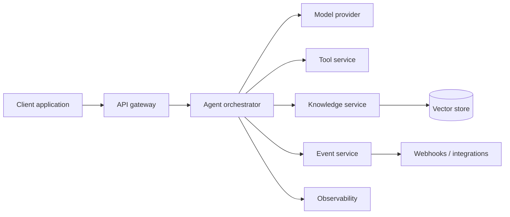

# AgentFlow architecture

## Component responsibilities

| Component | Responsibility |
| --- | --- |
| API gateway | Authenticates and routes client requests |
| Agent orchestrator | Coordinates instructions, tools, knowledge, and model calls |
| Tool service | Provides controlled access to external actions |
| Knowledge service | Retrieves approved contextual information |
| Event service | Emits lifecycle events and integration notifications |
| Observability | Captures logs, traces, execution status, and operational signals |

The diagram is intentionally conceptual. A production guide would add deployment boundaries, data flows, security controls, failure modes, and provider-specific details.
