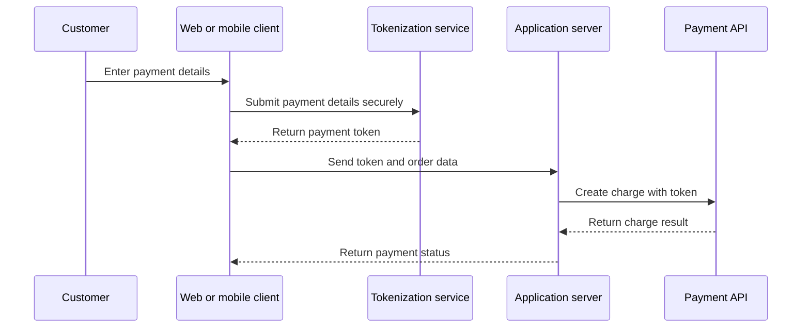

# Tokenization overview

Tokenization replaces sensitive payment data with a non-sensitive token that an application can use in later API requests. This self-authored example describes a generic integration pattern and does not represent a specific payment provider.

## Understand the flow

A client application should avoid sending raw payment credentials through application servers when the payment integration supports client-side tokenization.



## Use a payment token

A token can be represented by an opaque identifier such as `tok_demo_8421`. The application sends the token instead of the original payment details when it creates a charge.

```json
{
  "amount": 2500,
  "currency": "USD",
  "sourceToken": "tok_demo_8421"
}
```

## Design token documentation

Document the token lifecycle so developers understand where tokens are created and how they can be used. Define whether a token is single-use or reusable, its expiration behavior, supported payment methods, environment restrictions, and any relationship between a token and a customer or account.

Do not place real card numbers, security codes, access tokens, private keys, or production credentials in documentation examples. Use clearly fictional values.

## Continue the payment flow

After the client creates a token, the application can pass it to [Create a charge](create-charge.md). For an authorization followed by a later settlement, continue with [Capture a charge](capture-charge.md).
