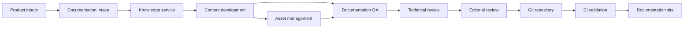

# Documentation automation architecture

The architecture separates source intake, content development, validation, review, and publishing so that each stage has a clear responsibility.

## Integration points

| Connector | Use |
| --- | --- |
| Jira | Release stories, requirements, and acceptance criteria |
| Confluence | Product context and approved source information |
| GitHub | Pull requests, code examples, reviews, and version history |
| OpenAPI | Endpoint definitions and API source material |
| Figma | UI references and approved design context |
| SharePoint | Controlled enterprise source documents |
| Deployment pipeline | Build validation and publishing |

The architecture favors traceable sources and explicit review over automatic publication.
