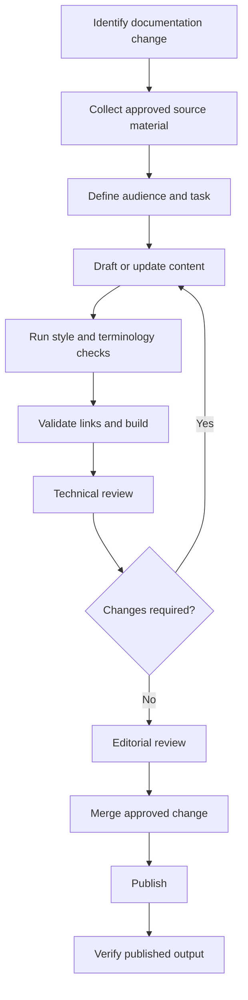

# Documentation automation workflow

## End-to-end flow

## Quality gates

A change should not publish merely because it builds. The workflow checks four different concerns:

1. **Technical accuracy** — examples, behavior, prerequisites, and product details are verified.
2. **Editorial quality** — terminology, voice, headings, procedures, and accessibility are reviewed.
3. **Repository quality** — links, Markdown, and the MkDocs build pass automated checks.
4. **Published output** — navigation, formatting, assets, and links are checked after deployment.
