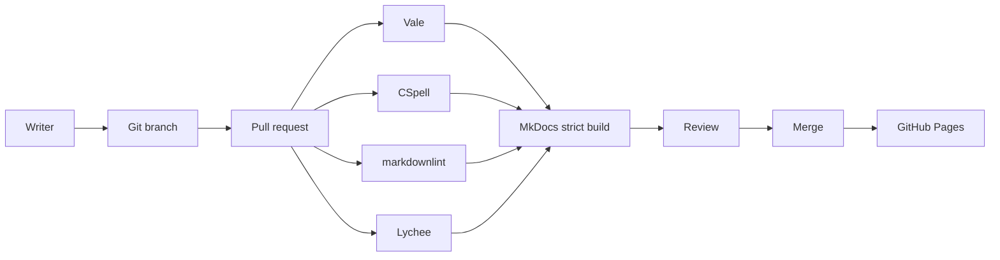

# Documentation CI/CD architecture

## Why separate checks?

Each tool answers a different question. Vale checks editorial rules, CSpell checks spelling, markdownlint checks source consistency, Lychee checks links, and MkDocs validates whether the site can build from its configuration and content.

The checks are most useful when their configuration is maintained with the documentation rather than treated as a one-time setup.
