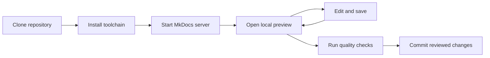

# Preview documentation locally

Previewing documentation locally lets writers review rendered changes before they create a commit or send changes to a shared staging environment. This shortens the feedback loop and reduces avoidable staging conflicts when several contributors are working at the same time.

## Understand the workflow



The MkDocs development server watches the documentation source. After you save a change, refresh the browser if the page does not update automatically. Keep the terminal session running while you review the site.

## Meet the prerequisites

| Requirement | Verification |
| --- | --- |
| Documentation repository | Clone the repository to your machine. |
| Python | Run `python --version`. Use the Python version required by the repository. |
| pip | Run `python -m pip --version`. |
| MkDocs | Run `python -m mkdocs --version`. |
| Project dependencies | Install the dependencies defined by the repository, preferably from its requirements or lock file. |

When you install Python on Windows, enable the installer option that adds Python to `PATH` if your environment requires it.

## Start the local preview

1. Open a terminal or Command Prompt.
2. Navigate to the cloned repository.
3. Verify Python:

   ```text
   python --version
   ```

4. Verify pip:

   ```text
   python -m pip --version
   ```

5. Verify MkDocs:

   ```text
   python -m mkdocs --version
   ```

6. Install the repository dependencies if they are not already available. For a repository with a requirements file, for example:

   ```text
   python -m pip install -r requirements.txt
   ```

7. Start the development server. For a standard MkDocs repository, run:

   ```text
   python -m mkdocs serve
   ```

   If a project uses a product-specific configuration, provide that configuration explicitly:

   ```text
   python -m mkdocs serve --config-file=<configuration-file>.yml
   ```

8. Open the local URL displayed in the terminal. MkDocs commonly uses `http://127.0.0.1:8000/`.
9. Edit and save a documentation file, then review the rendered change in the browser.
10. Keep the terminal open until you finish the preview. Stop the server with `Ctrl+C`.

## Resolve missing dependencies

If MkDocs reports a missing plugin or extension, install the dependency required by the repository instead of adding packages indiscriminately. Common dependencies for Material for MkDocs projects can include the Material theme and extensions, image lightbox support, and redirect support.

Install the packages declared by the project configuration or requirements file. A repository-level requirements file is preferable because it gives contributors a repeatable environment.

## Start from GitHub Desktop

When you work with several repositories, opening the terminal from GitHub Desktop can reduce directory mistakes:

1. Open GitHub Desktop.
2. Select the correct repository.
3. Open the repository in a command prompt or terminal from the repository menu.
4. Run the appropriate MkDocs serve command.

## Control automatic rebuilds

MkDocs rebuilds the local site when watched files change. If editor Auto Save causes unwanted rebuilds during large edits, turn off **File > Auto Save** in Visual Studio Code and save when you are ready to preview.

## Commit after review

After the local preview is correct, run the repository's style, spelling, link, and strict-build checks. Commit the change only after the source and rendered output have passed review.
