# Documentation migration process

```mermaid
flowchart LR
    A[Inventory legacy content] --> B[Classify templates and tags]
    B --> C[Define target content model]
    C --> D[Parse source files]
    D --> E[Transform markup]
    E --> F[Rewrite links and assets]
    F --> G[Generate Markdown]
    G --> H[Build target site]
    H --> I[Editorial validation]
```

## Process

1. Inventory files, templates, custom tags, assets, and link patterns.
2. Identify obsolete and duplicate content before conversion.
3. Define mappings for headings, notes, warnings, code, tables, links, and images.
4. Convert repeatable patterns with a script.
5. Flag unsupported structures for manual review.
6. Build the target site in batches.
7. Validate links, images, formatting, navigation, and content meaning.
8. Redirect or archive legacy URLs as required by the publishing platform.

A migration script is a transformation tool, not the final quality check.
