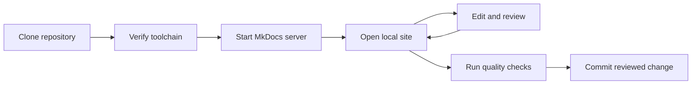

# Preview documentation locally

A shared staging environment is useful for integration review, but requiring a commit for every visual check creates an unnecessary feedback loop. Writers can preview MkDocs content on their own machine, correct issues, and commit the reviewed change when it is ready.

## Understand the problem

When every preview requires a commit to the staging workflow, small formatting and content corrections generate additional commits. Concurrent changes can also create avoidable conflicts. A local preview moves this review step earlier in the authoring workflow.

## Use the local-preview workflow



This workflow provides a short edit-and-review cycle while keeping the shared staging environment available for integration validation.

## Meet the prerequisites

| Requirement | Check |
| --- | --- |
| Repository | Clone the documentation repository to the local machine. |
| Python | Run `python --version`. Use Python 3.12 or the version required by the repository. |
| pip | Run `python -m pip --version`. |
| MkDocs | Run `python -m mkdocs --version`. |
| Project dependencies | Install the packages defined by the repository requirements. |

When installing Python on Windows, select the installer option that adds Python to `PATH` when required by your environment.

## Start the preview

1. Open Command Prompt or a terminal.
2. Navigate to the cloned repository. For example:

   ```text
   cd Desktop/GitHub/docs
   ```

3. Verify Python:

   ```text
   python --version
   ```

4. Verify pip:

   ```text
   python -m pip --version
   ```

5. Verify MkDocs:

   ```text
   python -m mkdocs --version
   ```

6. Install the repository dependencies if required. For a repository that provides `requirements.txt`, run:

   ```text
   python -m pip install -r requirements.txt
   ```

7. Start MkDocs. For a standard project, run:

   ```text
   python -m mkdocs serve
   ```

   For a repository with a separate configuration file, run:

   ```text
   python -m mkdocs serve --config-file=<configuration-file>.yml
   ```

8. Wait for the build to finish, then open the local address displayed in the terminal. MkDocs commonly uses `http://127.0.0.1:8000/`.
9. Edit and save the documentation. Review the updated page in the local site.
10. Keep the terminal open while you work. Press `Ctrl+C` when you want to stop the local server.

## Resolve dependency errors

If MkDocs reports a missing extension, theme, or plugin, install the dependency declared by the project configuration. A repository requirements file is preferable because it gives every contributor a repeatable environment.

For this portfolio repository, install its requirements instead of maintaining a separate list of commands:

```text
python -m pip install -r requirements.txt
```

After the installation completes, start the MkDocs server again.

## Open the terminal from GitHub Desktop

Opening the terminal from the repository reduces the chance of running a command in the wrong directory:

1. Open GitHub Desktop.
2. Confirm that the correct repository is selected.
3. Open the repository in Command Prompt or your preferred terminal.
4. Run the MkDocs command used by the project.

## Control automatic rebuilds

MkDocs watches source files and rebuilds the local site after a saved change. If frequent saves interrupt a large edit, turn off **File > Auto Save** in Visual Studio Code and save when you are ready to review the page.

## Validate the result

Before committing the change:

1. Review the rendered page for layout, navigation, code blocks, tables, images, and diagrams.
2. Run the repository's Vale and spelling checks.
3. Check internal and external links.
4. Run a strict MkDocs build.
5. Commit the change after the local source and rendered output pass review.

The local preview does not replace the shared staging environment. It removes unnecessary preview commits and leaves staging for integration-level review.
